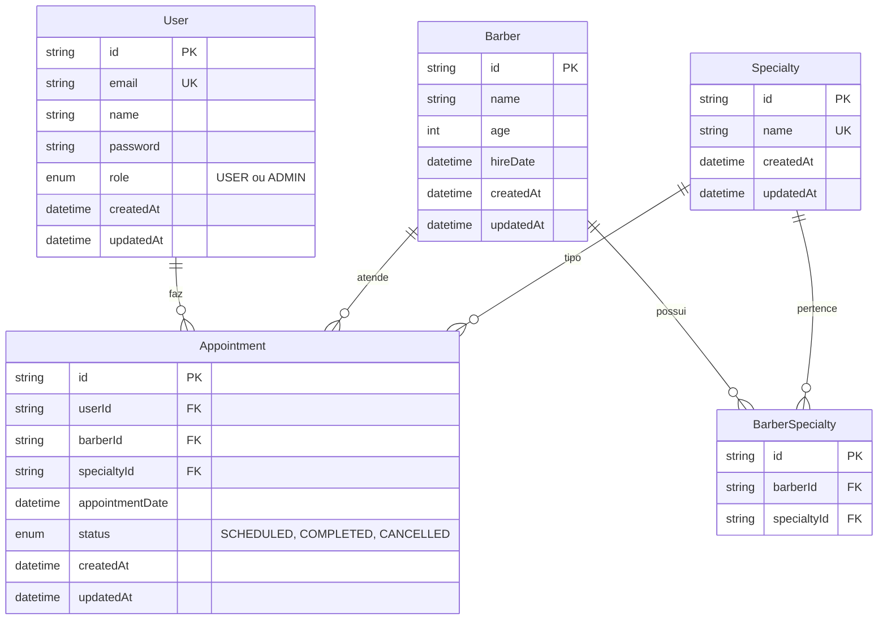

# Diagrama Entidade-Relacionamento - ClickBeard

## Entidades e Relacionamentos

## Descrição das Entidades

### User (Usuário)
- Representa os clientes e administradores do sistema
- Pode fazer múltiplos agendamentos
- Role define se é cliente (USER) ou administrador (ADMIN)

### Barber (Barbeiro)
- Profissionais que prestam os serviços
- Podem ter múltiplas especialidades
- Atendem múltiplos agendamentos

### Specialty (Especialidade)
- Tipos de serviços oferecidos (corte, barba, etc)
- Podem ser associadas a múltiplos barbeiros

### BarberSpecialty (Barbeiro_Especialidade)
- Tabela de relacionamento N:N entre Barber e Specialty
- Define quais serviços cada barbeiro oferece

### Appointment (Agendamento)
- Representa um agendamento de serviço
- Relaciona cliente, barbeiro, especialidade e horário
- Status controla o ciclo de vida do agendamento

## Constraints Importantes

1. **User.email** - Único no sistema
2. **Specialty.name** - Único no sistema
3. **Appointment** - Um barbeiro não pode ter dois agendamentos no mesmo horário (considerando status != CANCELLED)
4. **BarberSpecialty** - Combinação barberId + specialtyId deve ser única